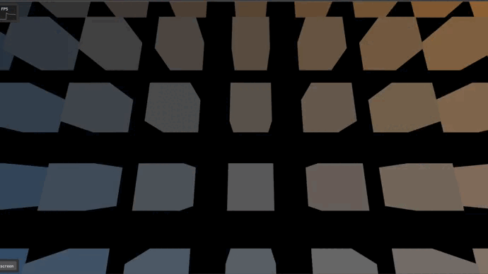

# ABCg

Daniel Fusimoto Pires - RA: 11201921874


[](https://github.com/hbatagelo/abcg/releases/latest)

Development framework accompanying the course [MCTA008-17 Computer Graphics](http://professor.ufabc.edu.br/~harlen.batagelo/cg/) at [UFABC](https://www.ufabc.edu.br/).

[Documentation](https://hbatagelo.github.io/abcg/abcg/doc/html/) \| [Release notes](CHANGELOG.md) 

ABCg is a lightweight C++ framework that simplifies the development of 3D graphics applications based on [OpenGL](https://www.opengl.org), [OpenGL ES](https://www.khronos.org), [WebGL](https://www.khronos.org/webgl/), and [Vulkan](https://www.vulkan.org). It is designed for the tutorials and assignments of the course "MCTA008-17 Computer Graphics" taught at Federal University of ABC (UFABC).

# Atividade 04 - Simulação de jogo de plataforma em primeira pessoa



GitHub Pages: [Basic Minecraft](https://fusidaniel.github.io/CG-Atv4/public/full_window.html)

## Descrição Geral

- Foi desenvolvido um ambiente simples de blocos espalhados, onde o usuário pode se mover pulando de bloco em bloco.
- O projeto foi baseado na movimentação do jogo Minecraft, neste projeto foram implementadas as funções de movimentação do personagem e da câmera, gravidade, salto, agachamento e corrida. Além um sistema simples de colisão que permite detectar se o usuário errou ou não oo pulo.

# Controles

| KEY        | FUNCTION                                                |
| :--------- | ------------------------------------------------------- |
| W A S D    | Movimentação do personagem                        |
| Mouse          | Movimentação da câmera (semelhante ao controle trackball, segurar botão esquerdo e arrastar na tela)                           |
| Shift Esquerdo         | Faz personagem esgueirar e andar mais devagar quando combinado com WASD                              |
| Control Esquerdo         | Faz personagem correr quando combinado com WASD |
| Barra de Espaço         | Pulo                              |

## To Do / Não deu tempo para fazer

- Por falta de tempo não consegui iniciar o processo de texturização dos blocos, iluminação mais elaborada e texturização do ambiente.
- Também não consegui gerar os cubos por mim mesmo, ao invés de importar um .obj, acabei tendo problemas no processo de montar os triângulos.

## Implementação

### `main.cpp, lookat.frag, lookat.vert`
- Estes 3 arquivos foram reutilizados do projeto LookAt
- main.cpp é responsável pela inicialização do programa/janela da aplicação.
- lookat.frag, lookat.vert são responsáveis pelo shaders da aplicação

### `trackball.hpp e trackball.cpp`
- Aqui foi utilizada de base a implementação de trackball das atividades Viewer, entretanto, de uma forma mais simplificada. Aqui apenas lê-se o posicionamento do mouse da janela da aplicação e o armazena na variável m_lastXY, que é acessavel publicamente pela função getXY.

``` cpp
void TrackBall::mouseMove(glm::ivec2 const &position) {
  m_lastXY = updateXY(position);
}

void TrackBall::resizeViewport(glm::ivec2 const &size) {
  m_viewportSize = size;
}

glm::vec3 TrackBall::updateXY(glm::vec2 const &position) const {
  return glm::vec3(
      2.0f * position.x / gsl::narrow<float>(m_viewportSize.x) - 1.0f,
      1.0f - 2.0f * position.y / gsl::narrow<float>(m_viewportSize.y), 0.0f);
}

glm::vec3 TrackBall::getXY() const {
  return m_lastXY;
}
```
- Essa simplificação se deu porque para a movimentação da câmera no lookAt já implementado, apenas as coordenadas X e Y já eram suficientes, uma matriz com componentes de rotação X, Y e Z gerariam problemas posteriormente na responsividade e intuitividade da câmera.

### `camera.hpp e camera.cpp`
- Neste arquivo são definidas todas as funções relacionadas à movimentação da câmera, tanto em relação ao espaço, quanto à rotação em relação à si mesma.

#### crouching() reduz a altura da câmera
``` cpp
void Camera::crouching(bool isCrouching) {
  if (isCrouching)
    heightMultiplier = 0.833f;
  else
    heightMultiplier = 1.0f;
  computeViewMatrix();
}
```
#### trackball() transforma os inputs de X e Y trazidos de trackball::getXY() em rotação da câmera, utilizando a função glm::rotate sobre uma matriz de transformação e um vetor apontando para cima, e outro apontando para esquerda, de forma a gerar rotação horizontal e vertical respectivamente. Dessa forma, conseguimos uma rotação satisfatória, mantendo a câmera sempre na horizontal, ou seja, não mexendo na rotação entorno do eixo z, igual aos jogos FPS
``` cpp
void Camera::trackball(TrackBall trackBall, bool left_click) {
  if (!left_click) {
    m_trackBall = trackBall;
    return;
  }
  glm::mat4 transform{1.0f};
  auto const forward{glm::normalize(m_at - m_eye)};
  auto const left{glm::cross(m_up, forward)};

  // Rotate camera around its local x and y axis
  transform = glm::translate(transform, m_eye);
  transform = glm::rotate(transform,
                          m_trackBall.getXY()[0] - trackBall.getXY()[0], m_up);
  transform = glm::rotate(transform,
                          m_trackBall.getXY()[1] - trackBall.getXY()[1], left);
  transform = glm::translate(transform, -m_eye);

  m_at = transform * glm::vec4(m_at, 1.0f);

  m_trackBall = trackBall;
  computeViewMatrix();
}
```
#### dolly() e truck() são funções que fazem o personagem se movimentar no plano do jogo. Aqui calculamos o vetor que aponta para frente e esquerda da visão, desconsiderando a rotação horizontal da câmera, e verificando a colisão com os blocos.
``` cpp
void Camera::dolly(float speed) {
  // Compute forward vector (view direction)
  auto aux_at = m_at;
  aux_at[1] = 0.0f;
  auto forward{glm::normalize(aux_at - m_eye)};

  if (cubeSideColision(m_eye + forward * speed))
    return;

  // Move eye and center forward (speed > 0) or backward (speed < 0)
  m_eye += forward * speed;
  m_at += forward * speed;

  computeViewMatrix();
}

void Camera::truck(float speed) {
  // Compute forward vector (view direction)
  auto aux_at = m_at;
  aux_at[1] = 0.0f;
  auto forward{glm::normalize(aux_at - m_eye)};
  // Compute vector to the left
  auto const left{glm::cross(m_up, forward)};

  if (cubeSideColision(m_eye - left * speed))
    return;
  // Move eye and center to the left (speed < 0) or to the right (speed > 0)
  m_eye -= left * speed;
  m_at -= left * speed;

  computeViewMatrix();
}

```
#### cubeSideColision(), groundColision(), insideBlockColision() detectam colisão do personagem com a lateral do cubo, com o chão, e com o interior do cubo, respectivamente.

### jump() é uma função que aplica a gravidade no personagem controlado pelo usuário, nela temos resets da posição do usuário caso ele tenha caído, ou caso esteja dentro de um bloco. Além disso, caso o personagem esteja encostando no chão, ele tem a capacidade de pular, que adiciona uma velocidade dele apontando para cima. Quando está no ar, uma função de gravidade é aplicada sobre o personagem aumentando sua velocidade de queda até atingir uma velocidade terminal, ou acertar o chão, ou cair no buraco.
``` cpp
void Camera::jump(bool jump, float deltaTime) {
  if (m_eye[1] < -4.0f) {
    m_eye = {0.5f, 2.5f, 0.5f};
    computeViewMatrix();
    return;
  }

  if (insideBlockColision()) {
    m_eye[1] = 0.5f;
  }

  if (groundColision()) {
    if (jump)
      fallingSpeed = jumpSpeed;
    else
      fallingSpeed = 0.0;
  } else
    fallingSpeed += deltaTime * gravity * 0.1;

  fallingSpeed = std::max(fallingSpeed, terminalSpeed);

  m_at += m_up * fallingSpeed * deltaTime;
  m_eye += m_up * fallingSpeed * deltaTime;

  computeViewMatrix();
}
```
#### computeViewMatrix() é a função que aplica todas as transformações descritas anteriormente na matriz de visão do personagem
``` cpp
void Camera::computeViewMatrix() {
  if (groundColision())
    m_eye.y = std::max(0.5f, m_eye.y);

  auto aux_m_at = m_at;
  auto aux_m_eye = m_eye;
  aux_m_at.y *= heightMultiplier;
  aux_m_eye.y *= heightMultiplier;
  m_viewMatrix = glm::lookAt(aux_m_eye, aux_m_at, m_up);
}
```

### `window.hpp e window.cpp`
- Aqui é a definição da janela da aplicação, não foi alterado muito em relação ao projeto LookAt original, as alterações consistiram em adicionar alguns efeitos em onEvent() ao pressionar algumas teclas, como shift para se esgueirar, control para correr, e barra de espaço para pular. Além da adaptação dos inputs para a implementação simplificada do trackball.
- Tirando os inputs, na parte de onUpdate(), foram acrescentados multiplicadores de velocidade, além do chamado às funções m_camera.trackball() e m_camera.jump()

``` cpp
void Window::onUpdate() {
  auto const deltaTime{gsl::narrow_cast<float>(getDeltaTime())};

  // Update LookAt camera
  m_camera.dolly(m_dollySpeed * deltaTime * speedMultiplier);
  m_camera.truck(m_truckSpeed * deltaTime * speedMultiplier);
  m_camera.trackball(m_trackBall, left_click);
  m_camera.jump(jumping, deltaTime);
}
```


## License

ABCg is licensed under the MIT License. See [LICENSE](https://github.com/hbatagelo/abcg/blob/main/LICENSE) for more information.
